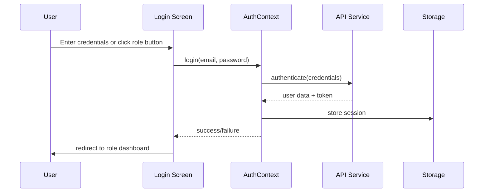
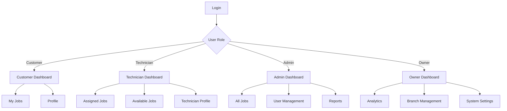

# Design Document

## Overview

The user role management system provides secure authentication and authorization for the repair shop management app. It implements a multi-role architecture supporting customers, technicians, admins, and owners with appropriate permissions and user interfaces tailored to each role.

## Architecture

### Authentication Flow


### Role-Based Navigation


## Components and Interfaces

### Enhanced Login Screen
- **One-Click Role Buttons**: Quick login for demo users
- **Form Validation**: Real-time validation with visual feedback
- **Error Handling**: Clear error messages for authentication failures
- **Responsive Design**: Works across mobile and web platforms

### AuthContext Enhancement
```typescript
interface AuthContextType {
  user: User | null;
  login: (email: string, password: string) => Promise<boolean>;
  quickLogin: (role: UserRole) => Promise<boolean>; // New method
  logout: () => void;
  isLoading: boolean;
  updateUser: (userData: Partial<User>) => void;
  hasPermission: (permission: string) => boolean; // New method
}
```

### Role-Based Components
- **RoleGuard**: Component to protect routes based on user role
- **PermissionWrapper**: Component to conditionally render UI elements
- **RoleDashboard**: Dynamic dashboard that adapts to user role

### User Management Interface (Admin/Owner)
- **UserList**: Display all users with filtering and search
- **UserForm**: Create/edit user accounts
- **RoleAssignment**: Change user roles with confirmation
- **UserProfile**: Detailed user information and activity

## Data Models

### Enhanced User Model
```typescript
interface User {
  id: string;
  email: string;
  name: string;
  role: UserRole;
  avatar?: string;
  phone?: string;
  address?: string;
  isActive: boolean; // New field
  lastLogin?: Date; // New field
  createdAt: Date; // New field
  permissions: string[]; // New field
}
```

### Technician Profile Extension
```typescript
interface TechnicianProfile extends User {
  specializations: string[];
  branchId: string;
  branchName: string;
  isAvailable: boolean;
  workSchedule: WorkSchedule;
  completedJobs: number;
  averageRating: number;
}

interface WorkSchedule {
  monday: TimeSlot[];
  tuesday: TimeSlot[];
  wednesday: TimeSlot[];
  thursday: TimeSlot[];
  friday: TimeSlot[];
  saturday: TimeSlot[];
  sunday: TimeSlot[];
}

interface TimeSlot {
  start: string; // "09:00"
  end: string;   // "17:00"
}
```

### Session Management
```typescript
interface UserSession {
  userId: string;
  token: string;
  refreshToken: string;
  expiresAt: Date;
  deviceInfo: DeviceInfo;
  lastActivity: Date;
}

interface DeviceInfo {
  platform: 'web' | 'ios' | 'android';
  userAgent: string;
  ipAddress: string;
}
```

## Error Handling

### Authentication Errors
- **Invalid Credentials**: Clear message with retry option
- **Account Locked**: Information about lockout duration
- **Session Expired**: Automatic redirect to login with context preservation
- **Network Errors**: Offline handling with retry mechanism

### Authorization Errors
- **Insufficient Permissions**: Friendly message explaining access restrictions
- **Role Changes**: Handle real-time role updates gracefully
- **Account Deactivation**: Immediate logout with explanation

### Error Recovery
- **Auto-retry**: For network-related authentication failures
- **Graceful Degradation**: Limited functionality when offline
- **Error Logging**: Comprehensive logging for debugging

## Testing Strategy

### Unit Tests
- **AuthContext**: Test all authentication methods
- **Role Guards**: Verify permission checking logic
- **Form Validation**: Test all validation rules
- **User Management**: Test CRUD operations

### Integration Tests
- **Login Flow**: End-to-end authentication process
- **Role Switching**: Test role changes and permission updates
- **Session Management**: Test session expiration and renewal
- **Cross-Platform**: Test on web, iOS, and Android

### Security Tests
- **Password Security**: Test hashing and validation
- **Token Security**: Test JWT handling and expiration
- **Permission Bypass**: Attempt to access restricted features
- **Session Hijacking**: Test session security measures

## Security Considerations

### Password Security
- **Hashing**: Use bcrypt with appropriate salt rounds
- **Complexity**: Enforce strong password requirements
- **Reset**: Secure password reset with time-limited tokens

### Token Management
- **JWT**: Use signed tokens with appropriate expiration
- **Refresh Tokens**: Implement secure token renewal
- **Revocation**: Support for token blacklisting

### Session Security
- **HTTPS**: Enforce secure connections
- **CSRF Protection**: Implement CSRF tokens for state changes
- **Rate Limiting**: Prevent brute force attacks

### Data Protection
- **Encryption**: Encrypt sensitive data at rest
- **Audit Logging**: Log all authentication events
- **Privacy**: Implement data retention policies

## Performance Considerations

### Authentication Performance
- **Token Caching**: Cache valid tokens to reduce API calls
- **Lazy Loading**: Load user permissions on demand
- **Background Refresh**: Refresh tokens before expiration

### UI Performance
- **Role-Based Rendering**: Conditionally render components
- **Permission Caching**: Cache permission checks
- **Optimistic Updates**: Update UI before API confirmation

## Accessibility

### Login Screen
- **Screen Reader**: Proper labels and descriptions
- **Keyboard Navigation**: Full keyboard accessibility
- **High Contrast**: Support for high contrast mode
- **Font Scaling**: Respect system font size settings

### Role-Based UI
- **Focus Management**: Proper focus handling for role changes
- **Announcements**: Screen reader announcements for role switches
- **Color Independence**: Don't rely solely on color for role indication

## Internationalization

### Multi-Language Support
- **Login Messages**: Translate all authentication messages
- **Role Names**: Localize role names and descriptions
- **Error Messages**: Provide localized error messages
- **Date/Time**: Format according to user locale

## Migration Strategy

### Existing Users
- **Data Migration**: Migrate existing user data to new schema
- **Permission Assignment**: Assign default permissions based on roles
- **Session Cleanup**: Clear existing sessions to force re-authentication

### Backward Compatibility
- **API Versioning**: Maintain compatibility with existing API calls
- **Gradual Rollout**: Phase in new features progressively
- **Fallback Mechanisms**: Provide fallbacks for unsupported features